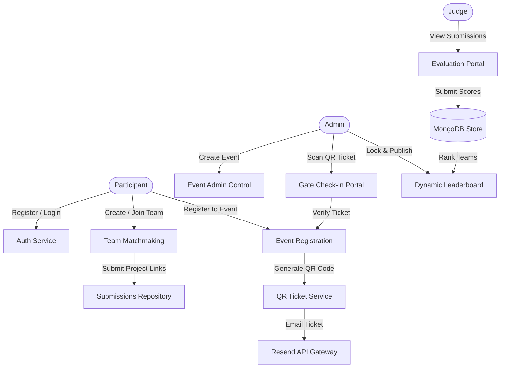

# 🌌 HackFlow

**HackFlow** is a premium, feature-rich, full-stack hackathon management and evaluation platform. Engineered with a secure Role-Based Access Control (RBAC) architecture, it streamlines every phase of a hackathon: from dynamic team matchmaking and automated QR-ticket check-ins via mobile cameras, to multi-criteria judging and mathematically compiled live leaderboards.

[Key Features](#-key-features) • [System Flow](#-system-flow) • [Tech Stack](#-tech-stack) • [Live Demo & Testing](#-live-demo--testing) • [API Directory](#-api-directory) • [Getting Started](#-getting-started) • [Security & Production](#-security--production)

---

## ⚡ Live Demo & Testing

You can access the production-ready build of HackFlow using the following links:

*   **🖥️ Live Client Web App:** [https://hack-flow-rust.vercel.app/](https://hack-flow-rust.vercel.app/) *(Hosted on Vercel)*
*   **⚙️ Live API Gateway:** [https://hackflow-api.onrender.com](https://hackflow-api.onrender.com) *(Hosted on Render)*

> [!TIP]
> If you are deploying the project on your own custom Vercel/Render accounts, replace the URLs above with your unique domains.

### 👥 Quick-Start Test Accounts
To explore the dashboard interfaces and experience the RBAC permissions system without registering new accounts, use these pre-configured credentials:

| Role | Email Address | Password | Privileges / Features |
| :--- | :--- | :--- | :--- |
| **Administrator** | `admin@hackflow.com` | `AdminPass123!` | Create events, scanner check-in, assign judges, lock/publish leaderboards |
| **Judge** | `judge@hackflow.com` | `JudgePass123!` | Evaluation portal, rate submissions on custom weighted criteria |
| **Participant** | `captain@hackflow.com` | `TeamPass123!` | Matchmaking, join/create teams, submit projects and repositories |

---

## ✨ Key Features

### 👤 Role-Based Access Control (RBAC)
Strict API shields enforce specific boundaries around three roles:
*   **Participants / Teams:** Build profiles, showcase portfolios, invite team members, register for hackathons, and submit final projects.
*   **Judges:** Evaluate project submissions using dedicated visual dashboards with event-specific criteria.
*   **Administrators:** Manage events, broadcast announcements, scan check-in tickets, and lock/publish leaderboards.

### 🎫 Automated QR Ticketing & Mobile Check-in
*   **Secure Ticket Dispatch:** Upon registering for an event, the backend compiles a unique ID into a base64 QR Code.
*   **Resend API Mailer:** Instantly dispatches high-fidelity confirmation emails containing the inline QR ticket using the Resend HTTP API.
*   **In-Browser Camera Scanner:** Administrators can use a built-in mobile camera scanner on-site to verify tickets via `/api/events/:eventId/checkin/:registrationId`, recording attendance in real-time.

### 👥 Matchmaking & Team Dynamics
*   **Available Talents Search:** Search and filter active participants by skills, interests, and availability.
*   **Invite Pipeline:** Send invitations or review incoming requests. Captains have sole authority to invite members, remove members, or submit links.

### ⚖️ Multi-Criteria Judging & Live Standings
*   **Weighted Scoring:** Evaluates projects using customized parameters (e.g., *Innovation, Technicality, Design, Pitch*).
*   **Locked Grades:** Prevent scores from being modified after administrators publish the final results.
*   **Mathematical Sorting:** Leaderboards auto-calculate overall weighted score totals in real-time.

---

## 🔄 System Flow

## 📂 Project Architecture

HackFlow/
├── .github/
│   └── workflows/
│       └── ci.yml           # GitHub Actions continuous integration testing
├── Backend/                 # Express REST Server
│   ├── src/
│   │   ├── config/          # Database connection, Resend, & Cloudinary configurations
│   │   ├── controllers/     # Controller handlers (Auth, Event, Team, Evaluation, User)
│   │   ├── middleware/      # Authentication, file upload, & validation middleware
│   │   ├── models/          # Mongoose DB schemas (Event, Team, User, Registration, Evaluation)
│   │   ├── routes/          # Express Router mounts (Auth, User, Admin, Event, Team)
│   │   └── utils/           # HTML email templates and delivery helpers
│   ├── server.js            # Node App starting script
│   └── Dockerfile           # Production container compilation settings
├── frontend/                # React SPA Client
│   ├── src/
│   │   ├── api/             # Axios configuration with response interceptors
│   │   ├── components/      # Modular UI widgets, navigation bars, & camera scanners
│   │   ├── context/         # AuthContext state provider (token renewal & sessions)
│   │   ├── pages/           # Pages (Admin, Leaderboard, Profiles, Event Dashboards)
│   │   └── index.css        # Tailwind directives and customized CSS variables
│   ├── vercel.json          # SPA routing redirect file for Vercel deployment
│   └── vite.config.js       # Vite build configurations

