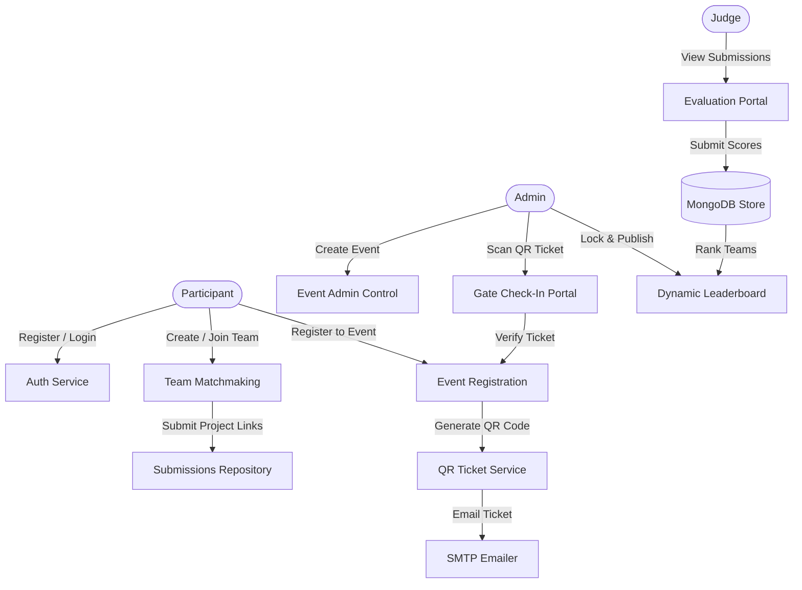

# 🌌 HackFlow

<div align="center">


**HackFlow** is a premium, feature-rich, full-stack hackathon management and evaluation platform. Engineered with a secure Role-Based Access Control (RBAC) architecture, it streamlines every phase of a hackathon: from dynamic team formation and automated QR-ticket check-ins to multi-criteria judging and mathematically compiled live leaderboards.

[Key Features](#-key-features) • [Tech Stack](#-tech-stack) • [System Flow](#-system-flow) • [API Directory](#-api-directory) • [Getting Started](#-getting-started) • [Environment Settings](#-environment-settings)

</div>

---

## ✨ Key Features

### 👤 User Personas & RBAC
HackFlow enforces strict security via **Role-Based Access Control (RBAC)** across three distinct user roles:
*   **Participants / Teams:** Build profiles, showcase portfolios, find team members, register for hackathons, and submit final projects.
*   **Judges:** Access a dedicated judging dashboard to evaluate team submissions based on event-specific criteria.
*   **Administrators:** Manage events, issue announcements, check-in attendees, override scores, and lock/publish final leaderboards.

---

### 🚀 Core Modules



#### 🎫 1. Automated QR Code Ticketing & Mobile Check-in
*   **Automated Generation:** On registration, the backend generates a unique `registrationId` and compiles it into a secure QR Code data URI.
*   **Instant Mailout:** Nodemailer triggers a high-fidelity ticket email directly to the participant.
*   **Gate Scanning:** Administrators can scan tickets using a built-in QR camera reader that connects directly to the `/api/events/:eventId/checkin/:registrationId` endpoint, logging check-in times in real-time and preventing duplicate entries.

#### 👥 2. Matchmaking & Team Dynamics
*   **Matchmaking Search:** Search for available participants filtered by skills and interests.
*   **Invites & Applications:** Team captains can invite members or approve pending join requests.
*   **Project Submission:** CAPTAINS can upload repository links, video demonstrations, and descriptions prior to the lockdown timeline.

#### ⚖️ 3. Multi-Criteria Judging Portal
*   **Granular Metrics:** Judges rate projects across custom parameters (e.g., *Innovation, Implementation, Design, Pitch*).
*   **Weighted Scoring:** Standardized inputs ensure calculations are managed securely on the backend.
*   **Submissions Pipeline:** An elegant, distraction-free grid displays all submissions along with quick links to live projects, slide decks, and repositories.

#### 🏆 4. Live Ranked Leaderboard
*   **Real-time Calculations:** Scores are aggregated, weighted, and sorted automatically.
*   **Publish Control:** Administrators maintain complete authority to review, lock, and publish leaderboards once judging is concluded.

---

## 🛠️ Tech Stack

### Frontend Architecture
*   **Framework:** [React 19](https://react.dev/) with [Vite](https://vite.dev/)
*   **Styling:** [Tailwind CSS v4](https://tailwindcss.com/)
*   **Animations:** [Framer Motion](https://www.framer.com/motion/) for fluid transitions
*   **Routing:** [React Router v7](https://reactrouter.com/)
*   **QR Scanner:** [HTML5-QRCode](https://github.com/mebjas/html5-qrcode) for high-performance camera processing
*   **Icons:** [Lucide React](https://lucide.dev/)

### Backend Services
*   **Runtime:** [Node.js](https://nodejs.org/) & [Express.js v5](https://expressjs.com/)
*   **Database:** [MongoDB](https://www.mongodb.com/) via [Mongoose ORM](https://mongoosejs.com/)
*   **Authentication:** JWT with Access/Refresh token rotation and HTTP-only cookie storage
*   **File Uploads:** [Multer](https://github.com/expressjs/multer) & [Cloudinary SDK](https://cloudinary.com/) for cloud media storage
*   **Monitoring:** [Sentry](https://sentry.io/) node instrumentation for real-time crash reports
*   **Security:** [Helmet](https://helmetjs.github.io/) headers and [Express-Rate-Limit](https://www.npmjs.com/package/express-rate-limit) to thwart DDoS attempts

---

## 📂 Project Structure

```
HackFlow/
├── Backend/                 # Express Server & DB Handlers
│   ├── src/
│   │   ├── config/          # Database & configuration files
│   │   ├── controllers/     # Core route controllers (Auth, Event, Team...)
│   │   ├── middleware/      # Auth shields, file upload configs, rate-limiters
│   │   ├── models/          # Mongoose collection schemas
│   │   ├── routes/          # Express route endpoints
│   │   └── utils/           # Nodemailer HTML template generators
│   ├── server.js            # Server entry point & DB connector
│   └── Dockerfile           # Backend containerization file
│
├── frontend/                # React Vite SPA
│   ├── public/              # Static assets & SVGs
│   ├── src/
│   │   ├── api/             # Axios interceptor configurations
│   │   ├── components/      # Global components (dashboards, scanners...)
│   │   ├── context/         # AuthContext & global states
│   │   ├── pages/           # Pages (Admin, Leaderboard, Profiles...)
│   │   ├── index.css        # Tailwind configuration & global styles
│   │   └── App.jsx          # Route configuration mapping
│   └── vite.config.js       # Vite build configurations
```

---

## 🔌 API Directory

| Category | Method | Endpoint | Access | Description |
| :--- | :--- | :--- | :--- | :--- |
| **Authentication** | `POST` | `/api/auth/register` | Public | Register a new user |
| | `POST` | `/api/auth/verify-email` | Public | Verify user email address |
| | `POST` | `/api/auth/login` | Public | Auth user & set token cookies |
| | `POST` | `/api/auth/refresh` | Public | Rotate expired access token |
| | `POST` | `/api/auth/logout` | Public | Clear HTTP-only session cookies |
| **User Profiles** | `PUT` | `/api/users/profile` | Private | Update profile & upload avatar |
| | `GET` | `/api/users/profile/:username` | Public | Fetch public portfolio details |
| **Events** | `GET` | `/api/events` | Public | List all upcoming/active events |
| | `POST` | `/api/events` | Admin Only | Create a new event |
| | `PUT` | `/api/events/:eventId` | Host/Admin | Edit event settings & timelines |
| | `POST` | `/api/events/:eventId/register` | Private | Register participant for event |
| | `POST` | `/api/events/:eventId/checkin/:regId` | Admin Only | Check-in participant via QR Code |
| **Teams** | `POST` | `/api/teams/event/:eventId` | Registered | Create a team for an event |
| | `POST` | `/api/teams/:teamId/invite/:userId` | Captain Only | Invite participant to team |
| | `POST` | `/api/teams/:teamId/accept-invite` | Invited | Join team from notification |
| | `PUT` | `/api/teams/:teamId/submit` | Captain Only | Submit project files/URLs |
| **Evaluation** | `POST` | `/api/teams/:teamId/evaluate` | Judge Only | Submit project scores |
| | `GET` | `/api/events/:eventId/leaderboard` | Private | View live standings |
| | `PUT` | `/api/events/:eventId/publish-leaderboard`| Admin Only | Publish standings & lock grades |

---

## 🔑 Environment Settings

Create a `.env` file in the **Backend/** directory:

```env
# Server Configuration
PORT=5000
NODE_ENV=development

# Database
MONGO_URI=your_mongodb_connection_string

# Authentication Secrets
JWT_SECRET=your_jwt_access_secret_key
JWT_REFRESH_SECRET=your_jwt_refresh_secret_key

# Cloudinary Storage
CLOUDINARY_CLOUD_NAME=your_cloudinary_cloud_name
CLOUDINARY_API_KEY=your_cloudinary_api_key
CLOUDINARY_API_SECRET=your_cloudinary_api_secret

# SMTP Email Settings
EMAIL_USER=your_smtp_email@gmail.com
EMAIL_PASS=your_smtp_app_password
SMTP_HOST=smtp.gmail.com
SMTP_PORT=465
SMTP_SECURE=true

# Error Monitoring (Optional)
SENTRY_DSN=your_sentry_dsn_url
```

---

## 🚀 Getting Started

### Backend Setup
1. Navigate to the backend directory:
   ```bash
   cd Backend
   ```
2. Install dependencies:
   ```bash
   npm install
   ```
3. Initialize the server:
   ```bash
   npm run dev
   ```
   *The API server will launch on `http://localhost:5000` (or your configured `PORT`).*

### Frontend Setup
1. Open a new terminal and navigate to the frontend directory:
   ```bash
   cd frontend
   ```
2. Install dependencies:
   ```bash
   npm install
   ```
3. Start the Vite development server:
   ```bash
   npm run dev
   ```
   *The web client will load on `http://localhost:5173`.*

---

## 🔒 Security Practices
*   **Security Headers:** Express app is protected using Helmet middleware configured to enforce strict CSP, HSTS, and frame protection.
*   **Rate Limiting:** Global rate limiters are set to 100 requests per 15 minutes, with specialized stricter limitations for authentication points to safeguard against brute-force attacks.
*   **Token Rotation:** Uses double-token JWT authentication logic. Short-lived Access Tokens are paired with secure database-tracked Refresh Tokens, allowing seamless re-authorization while remaining resilient against token hijacking.

---

<div align="center">
Made by Kunal Kumar Singh.
</div>
